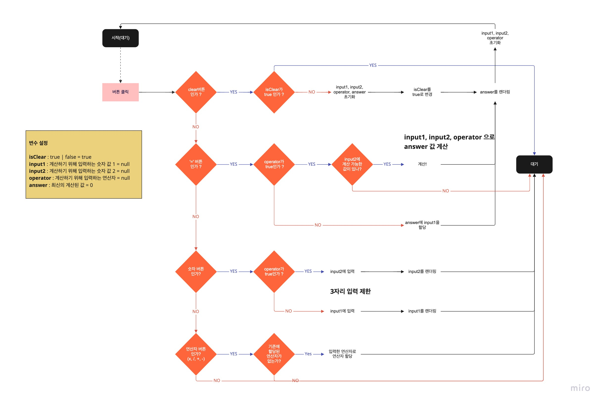

# TypeScript로 계산기 만들어보기

### 프로젝트 실행

```
  yarn dev
```

<br>

### 요구사항

- 게산기 기본 로직은 [네이버계산기](https://search.naver.com/search.naver?where=nexearch&sm=top_hty&ie=utf8&query=%EA%B3%84%EC%82%B0%EA%B8%B0%20)를 참고했습니다.

<br>

- [x] 올클리어 구현
- [x] 나누기 구현
- [x] 더하기 구현
- [x] 빼기 구현
- [x] 곱하기 구현
- [x] 마지막으로 "=" 클릭시 연산 완료
- [x] 이전 값을 베이스로 연산한다.
- [x] 키보드 입력이 아닌 클릭을 통해 숫자가 입력된다.

### 프로그래밍 순서도



<br>

### 작업 노트

- 코드를 치기 전에 설계를 먼저 하고 시작를 하는 습관을 만들고 싶어서 순서도를 작성해봤다. 막상 실제로 코드를 짜면서 순서도가 바뀌는 경우가 생겼다. 완벽한 설계는 없겠지만 그래도 어느 정도 완성될 코드를 생각하면서 설계도를 그려야하는 것 같다. 어렵겠지만 계속 하다보면 점점 더 좋은 설계도를 그릴 수 있겠지?
- 타입스크립트가 익숙하지 않아서인지 타입스크립트 기능을 잘 쓰지 못한 것 같다. 아직 인터페이스를 어디서 어떻게 써야하는지 잘 모르겠다. 그래도 타입스크립트를 써봤다는 것과 `HTML요소`의 타입을 지정하는 것은 확실하게 학습을 했다.
